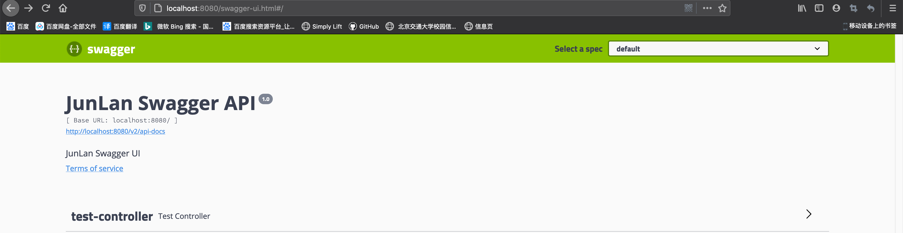
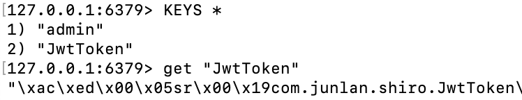

[TOC]


# 小俊兰博客

# 开始步骤

# 1. Swagger

https://swagger.io/

https://www.cnblogs.com/water-1/p/10820235.html

## Springfox swagger

https://github.com/springfox/springfox-demos

## 1. 依赖

```xml
<!-- swagger2 依赖 -->
<dependency>
  <groupId>io.springfox</groupId>
  <artifactId>springfox-swagger2</artifactId>
  <version>2.9.2</version>
</dependency>

<!-- swagger-ui 依赖 -->
<dependency>
  <groupId>io.springfox</groupId>
  <artifactId>springfox-swagger-ui</artifactId>
  <version>2.9.2</version>
</dependency>
```

## 2. 配置config

```java
@Configuration
public class SwaggerConfig {

    @Bean
    public Docket jlApi() {
        return new Docket(DocumentationType.SWAGGER_2)
                .apiInfo(apiInfo())
                .select()
                .apis(RequestHandlerSelectors.basePackage("com.junlan.controller"))
                .paths(PathSelectors.any())
                .build();
    }

    private ApiInfo apiInfo() {
        return new ApiInfoBuilder()
                .title("JunLan Swagger API")
                .description("JunLan Swagger UI")
                .termsOfServiceUrl("http://localhost:8080")
                .version("1.0")
                .build();
    }
}


/* 启动类 */
@SpringBootApplication
@EnableSwagger2     // Swagger支持
public class JunlanApplication {
    public static void main(String[] args) {
        SpringApplication.run(JunlanApplication.class, args);
    }
}
```

## 3. 访问

http://localhost:8080/swagger-ui.html



## 4. 注解

```java
 @Api("测试")
/**
 * 标记一个类作为 Swagger resource.
 */
public @interface Api {}

@ApiOperation(value = "摘要", notes = "详细信息")
/**
 * Describes an operation or typically a HTTP method against a specific path.
 * http请求对方法
 */
public @interface ApiOperation {}

/**
 * A wrapper to allow a list of multiple {@link ApiImplicitParam} objects.
 *
 * @see ApiImplicitParam
 */

public @interface ApiImplicitParams {
    ApiImplicitParam[] value();
}

```


## 5. token配置

### 1. 指定方法配置

```java
@ApiImplicitParams({ @ApiImplicitParam(paramType = "header", dataType = "String",
                                       name = "token", value = "登录token", required = true) })
```


### 2. 全局配置

```java
@Configuration
public class SwaggerConfig {

    @Bean
    public Docket jlApi() {
        return new Docket(DocumentationType.SWAGGER_2)
                .apiInfo(apiInfo())
                .select()
                .apis(RequestHandlerSelectors.basePackage("com.junlan.controller"))
                .paths(PathSelectors.any())
                .build()
                // 配置统一参数，具体操作涉及见securityContexts
                .securitySchemes(securitySchemes())
                .securityContexts(securityContexts());
    }

    private ApiInfo apiInfo() {
        return new ApiInfoBuilder()
                .title("JunLan Swagger API")
                .description("JunLan Swagger UI")
                .termsOfServiceUrl("http://localhost:8080")
                .version("1.0")
                .build();
    }

    // 全站统一参数配置，一般是token。
    private List<ApiKey> securitySchemes() {
        List<ApiKey> apiKeyList= new ArrayList();
        apiKeyList.add(new ApiKey("token", "token", "header"));
        return apiKeyList;
    }

    //  配置应用于securitySchemes操作（通过正则表达式）和HTTP方法。
    private List<SecurityContext> securityContexts() {
        List<SecurityContext> securityContexts = new ArrayList<>();
        securityContexts.add(SecurityContext.builder().securityReferences(defaultAuth())
                //过滤要验证的路径
                .forPaths(PathSelectors.regex("^(?!auth).*$"))
                .build());
        return securityContexts;
    }

    // 增加全局认证
    List<SecurityReference> defaultAuth() {
        AuthorizationScope authorizationScope = new AuthorizationScope("global", "accessEverything");
        AuthorizationScope[] authorizationScopes = new AuthorizationScope[1];
        authorizationScopes[0] = authorizationScope;
        List<SecurityReference> securityReferences = new ArrayList<>();
        // 验证增加, 名称同securitySchemes()中header写入token
        securityReferences.add(new SecurityReference("token", authorizationScopes));
        return securityReferences;
    }
}
```


# 2. Mybatis-Plus

https://baomidou.com/,,,https://mybatis.plus/

## 1. 测试demo

1. pom.xml

```xml
<dependency>
  <groupId>com.baomidou</groupId>
  <artifactId>mybatis-plus-boot-starter</artifactId>
  <version>3.4.1</version>
</dependency>

<!-- mysql-->
<dependency>
  <groupId>mysql</groupId>
  <artifactId>mysql-connector-java</artifactId>
  <scope>runtime</scope>
</dependency>
```

2. User

   ```java
   @Data
   public class User {
       private Long id;
       private String username;
       private String usernick;
       private String password;
       private Long roleId;		// 数据库采取m_n命名，mybatis-plus采取驼峰命名才能映射
   }
   ```

   ### mapUnderscoreToCamelCase

   - 类型：`boolean`
   - 默认值：`true`

   - 是否开启自动驼峰命名规则（camel case）映射，即从经典数据库列名 A_COLUMN（下划线命名） 到经典 Java 属性名 aColumn（驼峰命名） 的类似映射。

3. UserMapper

   ```java
   import com.baomidou.mybatisplus.core.mapper.BaseMapper;
   public interface UserMapper extends BaseMapper<User> {
     // 与数据库名称对应
   }
   ```

4. Controller

   ```java
   @RestController
   @RequestMapping("/user")
   public class UserController {
   
       @Autowired(required = false)
       private UserMapper userMapper;
   
       @ApiOperation(value = "获取所有用户")
       @GetMapping("/getAll")
       public List<User> getAll() {
           List<User> users = userMapper.selectList(null);
           return users;
       }
   }
   ```

   

## 2. 官方CRUD

```java
package com.baomidou.mybatisplus.samples.crud;

import static org.assertj.core.api.Assertions.assertThat;

import java.util.List;
import java.util.Map;

import javax.annotation.Resource;

import org.junit.Assert;
import org.junit.Test;
import org.junit.runner.RunWith;
import org.springframework.boot.test.context.SpringBootTest;
import org.springframework.test.context.junit4.SpringRunner;

import com.baomidou.mybatisplus.core.conditions.query.LambdaQueryWrapper;
import com.baomidou.mybatisplus.core.conditions.query.QueryWrapper;
import com.baomidou.mybatisplus.core.metadata.IPage;
import com.baomidou.mybatisplus.core.toolkit.Wrappers;
import com.baomidou.mybatisplus.extension.plugins.pagination.Page;
import com.baomidou.mybatisplus.samples.crud.entity.User;
import com.baomidou.mybatisplus.samples.crud.mapper.UserMapper;

/**
 * <p>
 * 内置 CRUD 演示
 * </p>
 *
 * @author hubin
 * @since 2018-08-11
 */
@RunWith(SpringRunner.class)
@SpringBootTest
public class SampleTest {

    @Resource
    private UserMapper mapper;

    @Test
    public void aInsert() {
        User user = new User();
        user.setName("小羊");
        user.setAge(3);
        user.setEmail("abc@mp.com");
        assertThat(mapper.insert(user)).isGreaterThan(0);
        // 成功直接拿会写的 ID
        assertThat(user.getId()).isNotNull();
    }


    @Test
    public void bDelete() {
        assertThat(mapper.deleteById(3L)).isGreaterThan(0);
        assertThat(mapper.delete(new QueryWrapper<User>()
                .lambda().eq(User::getName, "Sandy"))).isGreaterThan(0);
    }


    @Test
    public void cUpdate() {
        assertThat(mapper.updateById(new User().setId(1L).setEmail("ab@c.c"))).isGreaterThan(0);
        assertThat(
                mapper.update(
                        new User().setName("mp"),
                        Wrappers.<User>lambdaUpdate()
                                .set(User::getAge, 3)
                                .eq(User::getId, 2)
                )
        ).isGreaterThan(0);
        User user = mapper.selectById(2);
        assertThat(user.getAge()).isEqualTo(3);
        assertThat(user.getName()).isEqualTo("mp");

        mapper.update(
                null,
                Wrappers.<User>lambdaUpdate().set(User::getEmail, null).eq(User::getId, 2)
        );
        assertThat(mapper.selectById(1).getEmail()).isEqualTo("ab@c.c");
        user = mapper.selectById(2);
        assertThat(user.getEmail()).isNull();
        assertThat(user.getName()).isEqualTo("mp");

        mapper.update(
                new User().setEmail("miemie@baomidou.com"),
                new QueryWrapper<User>()
                        .lambda().eq(User::getId, 2)
        );
        user = mapper.selectById(2);
        assertThat(user.getEmail()).isEqualTo("miemie@baomidou.com");

        mapper.update(
                new User().setEmail("miemie2@baomidou.com"),
                Wrappers.<User>lambdaUpdate()
                        .set(User::getAge, null)
                        .eq(User::getId, 2)
        );
        user = mapper.selectById(2);
        assertThat(user.getEmail()).isEqualTo("miemie2@baomidou.com");
        assertThat(user.getAge()).isNull();
    }


    @Test
    public void dSelect() {
        mapper.insert(
                new User().setId(10086L)
                        .setName("miemie")
                        .setEmail("miemie@baomidou.com")
                        .setAge(3));
        assertThat(mapper.selectById(10086L).getEmail()).isEqualTo("miemie@baomidou.com");
        User user = mapper.selectOne(new QueryWrapper<User>().lambda().eq(User::getId, 10086));
        assertThat(user.getName()).isEqualTo("miemie");
        assertThat(user.getAge()).isEqualTo(3);

        mapper.selectList(Wrappers.<User>lambdaQuery().select(User::getId))
                .forEach(x -> {
                    assertThat(x.getId()).isNotNull();
                    assertThat(x.getEmail()).isNull();
                    assertThat(x.getName()).isNull();
                    assertThat(x.getAge()).isNull();
                });
        mapper.selectList(new QueryWrapper<User>().select("id", "name"))
                .forEach(x -> {
                    assertThat(x.getId()).isNotNull();
                    assertThat(x.getEmail()).isNull();
                    assertThat(x.getName()).isNotNull();
                    assertThat(x.getAge()).isNull();
                });
    }

    @Test
    public void orderBy() {
        List<User> users = mapper.selectList(Wrappers.<User>query().orderByAsc("age"));
        assertThat(users).isNotEmpty();
    }

    @Test
    public void selectMaps() {
        List<Map<String, Object>> mapList = mapper.selectMaps(Wrappers.<User>query().orderByAsc("age"));
        assertThat(mapList).isNotEmpty();
        assertThat(mapList.get(0)).isNotEmpty();
        System.out.println(mapList.get(0));
    }

    @Test
    public void selectMapsPage() {
        IPage<Map<String, Object>> page = mapper.selectMapsPage(new Page<>(1, 5), Wrappers.<User>query().orderByAsc("age"));
        assertThat(page).isNotNull();
        assertThat(page.getRecords()).isNotEmpty();
        assertThat(page.getRecords().get(0)).isNotEmpty();
        System.out.println(page.getRecords().get(0));
    }

    @Test
    public void orderByLambda() {
        List<User> users = mapper.selectList(Wrappers.<User>lambdaQuery().orderByAsc(User::getAge));
        assertThat(users).isNotEmpty();
    }

    @Test
    public void testSelectMaxId() {
        QueryWrapper<User> wrapper = new QueryWrapper<>();
        wrapper.select("max(id) as id");
        User user = mapper.selectOne(wrapper);
        System.out.println("maxId=" + user.getId());
        List<User> users = mapper.selectList(Wrappers.<User>lambdaQuery().orderByDesc(User::getId));
        Assert.assertEquals(user.getId().longValue(), users.get(0).getId().longValue());
    }

    @Test
    public void testGroup() {
        QueryWrapper<User> wrapper = new QueryWrapper<>();
        wrapper.select("age, count(*)")
                .groupBy("age");
        List<Map<String, Object>> maplist = mapper.selectMaps(wrapper);
        for (Map<String, Object> mp : maplist) {
            System.out.println(mp);
        }
        /**
         * lambdaQueryWrapper groupBy orderBy
         */
        LambdaQueryWrapper<User> lambdaQueryWrapper = new QueryWrapper<User>().lambda()
                .select(User::getAge)
                .groupBy(User::getAge)
                .orderByAsc(User::getAge);
        for (User user : mapper.selectList(lambdaQueryWrapper)) {
            System.out.println(user);
        }
    }

    @Test
    public void testTableFieldExistFalse() {
        QueryWrapper<User> wrapper = new QueryWrapper<>();
        wrapper.select("age, count(age) as count")
                .groupBy("age");
        List<User> list = mapper.selectList(wrapper);
        list.forEach(System.out::println);
        list.forEach(x -> {
            Assert.assertNull(x.getId());
            Assert.assertNotNull(x.getAge());
            Assert.assertNotNull(x.getCount());
        });
        mapper.insert(
                new User().setId(10088L)
                        .setName("miemie")
                        .setEmail("miemie@baomidou.com")
                        .setAge(3));
        User miemie = mapper.selectById(10088L);
        Assert.assertNotNull(miemie);

    }

}
```


## 3. BaseMapper IService

**关于mybatis-plus中Service和Mapper的分析**

https://www.cnblogs.com/rain1024/p/12524552.html


- **果然，IService是BaseMapper的大扩充，不但包含了所有基本方法，还加入了很多批处理功能**
- **Service虽然加入了数据库的操作，但还是以业务功能为主**
- **而更加复杂的SQL查询，还是要靠Mapper对应的XML文件里去编写SQL语句**


# 3. JWT

**JSON WEB TOKEN**

https://jwt.io/introduction/

https://github.com/auth0/java-jwt

## 1. 简介

https://www.jianshu.com/p/576dbf44b2ae


### 包含

- Header：头部
- Payload：载荷
- Signature：签证

### 概述

- JSON Web Token（JWT）是目前最流行的**跨域身份验证**解决方案
- JSON Web令牌是一种开放的行业标准  RFC 7519方法，用于在双方之间安全地表示声明

## 2. Spring boot JWT

```java
package com.junlan.utils;

import com.auth0.jwt.JWT;
import com.auth0.jwt.JWTVerifier;
import com.auth0.jwt.algorithms.Algorithm;
import com.auth0.jwt.exceptions.JWTDecodeException;
import com.auth0.jwt.interfaces.DecodedJWT;

import java.util.Date;

/**
 * @Author LJ
 * @Date 2020/11/27
 * msg
 */

public class JwtUtils {

    // 过期时间 24 小时
    private static final long EXPIRE_TIME = 60 * 24 * 60 * 1000;
    // 密钥
    private static final String SECRET = "SHIRO+JWT+JunLan";

    /**
     * 生成 token
     *
     * @param username
     * @return 加密的token
     */
    public static String createToken(String username) {
        try {
            // 过期时间
            Date expire = new Date(System.currentTimeMillis() + EXPIRE_TIME);
            // 生成算法
            Algorithm algorithm = Algorithm.HMAC256(SECRET);
            // 附带username信息
            return JWT.create()
                    .withClaim("username", username)
                    //到期时间
                    .withExpiresAt(date)
                    //创建一个新的JWT，并使用给定的算法进行标记
                    .sign(algorithm);
        } catch (Exception e) {
            return null;
        }
    }

    /**
     * 校验 token 是否正确
     *
     * @param token    
     * @param username 用户名
     * @return 
     */
    public static boolean verify(String token, String username) {
        try {
            Algorithm algorithm = Algorithm.HMAC256(SECRET);
            //在token中附带了username信息
            JWTVerifier verifier = JWT.require(algorithm)
                    .withClaim("username", username)
                    .build();
            //验证 token
            verifier.verify(token);
            return true;
        } catch (Exception exception) {
            return false;
        }
    }

    /**
     * 获得token中的信息，无需secret解密也能获得
     *
     * @return token中包含的用户名
     */
    public static String getUsername(String token) {
        try {
            DecodedJWT jwt = JWT.decode(token);
            return jwt.getClaim("username").asString();
        } catch (JWTDecodeException e) {
            return null;
        }
    }
}
```


# 4. Shiro

https://shiro.apache.org/spring-boot.html

## 1. 依赖

```xml
<!-- shiro -->
<dependency>
  <groupId>org.apache.shiro</groupId>
  <artifactId>shiro-spring</artifactId>
  <version>1.7.0</version>
</dependency>
```

## 2. Spring boot plus

https://springboot.plus/guide/shiro-jwt.html#springboot-shiro-jwt

## 3. 简介

https://www.w3cschool.cn/shiro/co4m1if2.html

Apache Shiro 是 Java 的一个安全框架。


**Authentication**：身份认证 / 登录，验证用户是不是拥有相应的身份；

**Authorization**：授权，即**权限验证**，验证某个已认证的用户是否拥有某个权限；即验证某个用户是否拥有**某个角色**；或者细粒度的验证某个用户对某个资源是否具有**某个权限**。

**Session** **Management**：会话管理，即用户登录后就是一次会话，在没有退出之前，它的所有信息都在会话中。

**Cryptography**：加密，保护数据的安全性，如**密码加密**存储到数据库，而不是明文存储。


### 1. 架构


直接交互的对象是 Subject，也就是说 Shiro 的**对外 API 核心**就是 Subject

**Subject**：主体，代表了当前 “用户”，这个用户不一定是一个具体的人，与当前应用交互的任何东西都是  Subject，如网络爬虫，机器人等；即一个抽象概念；所有 Subject 都绑定到 SecurityManager，与 Subject  的所有交互都会委托给 SecurityManager；可以把 Subject 认为是一个门面；SecurityManager 才是**实际的执行者**；

**SecurityManager**：安全管理器；即所有与安全有关的操作都会与 SecurityManager 交互；且它管理着所有 Subject；可以看出它是 Shiro 的核心，它负责与后边介绍的其他组件进行交互；

**Realm**：域，Shiro 从从 Realm **获取安全数据**（如用户、角色、权限），就是说  SecurityManager 要验证用户身份，那么它需要从 Realm 获取相应的用户进行比较**以确定用户身份是否合法**；也需要从 Realm  得到用户相应的**角色 / 权限进行验证**用户是否能进行操作；可以把 Realm 看成 DataSource，即安全数据源。

也就是说对于我们而言，最简单的一个 Shiro 应用：

1. 应用代码通过 Subject 来进行认证和授权，而 Subject 又委托给 SecurityManager；
2. 我们需要给 Shiro 的 SecurityManager 注入 Realm，从而让 SecurityManager 能得到合法的用户及其权限进行判断。

**从以上也可以看出，Shiro 不提供维护用户 / 权限，而是通过 Realm 让开发人员自己注入。**


### 2. 权限管理RBAC

**1. 基于资源的权限管理(Resource-Based Access Control)** 

https://www.iteye.com/blog/globeeip-1236167

### 3. 继承关系

#### Filter

**BasicHttpAuthenticationFilter**


- Shiro Filter，是在整个 Shiro Web 应用中**请求的门户**【入口】，所有的请求都会被 ShiroFilter  拦截并进行相应的**链式处理**。

- ShiroFilterFactoryBean实现FactoryBean，是ShiroFilter的工厂类。

  

  

#### ShiroFilterFactoryBean


- https://blog.csdn.net/achenyuan/article/details/78541529 

- 在基于Spring的web应用程序中用于定义主Shiro过滤器的FactoryBean。 

- ShiroFilterFactoryBean实现FactoryBean，是ShiroFilter的工厂类。

  - yaml

  ```yaml
  ########### shiro配置 #######
  shiro:
    enable: true
    # 权限配置，List
    anno:
      # 排除登录登出
      - /login,/logout
      # 排除静态资源
      - /static/**,/templates/**
      # 排除Swagger
      - /swagger-ui.html,/docs,/doc.html,/swagger-resources/**,/webjars/**,/v2/api-docs,/csrf,/v2/api-docs-ext,/null/swagger-resources/**
      # 排除actuator
      - /actuator/**
      - # 排除首页
      - /,/index.html
      # 排除无权限页
      - /unauthorized/**
      # 排除测试路径
      - /test/**
  
    permission:
      - /user/**
    - /article/**
  ```

  - java--properties

  ```java
  package com.junlan.config.properties;
  
  import lombok.Data;
  import org.springframework.boot.context.properties.ConfigurationProperties;
  import org.springframework.stereotype.Component;
  
  import java.util.List;
  
  /**
   * @Author LJ
   * @Date 2020/12/1
   * msg Shiro 配置映射类，配置yaml的
   */
  
  @Data
  @ConfigurationProperties(value = "shiro")
  @Component
  public class ShiroProperties {
  
      /**
       * 是否启用
       */
      private boolean enable;
  
      /**
       * 路径权限配置, xxx-xxx松散绑定
       */
      private String filterChainDefinitions;
  
      /**
       * 设置无需权限路径集合
       */
      private List<String[]> anon;
  
      /*
      * 设置通过JwtShiro
      * */
      private List<String[]> permission;
  }
  ```

  

```java
/**
 * ShiroConfig
 * @author XJJ
 * @date 2019-09-27
 * 1. 请求门户入口，是ShiroFilter的工厂类
 *
 **/


@Configuration
public class ShiroConfig {

    // JWT过滤器名称
    private static final String JWT_FILTER_NAME = "jwtFilter";

    //Shiro过滤器名称
    private static final String SHIRO_FILTER_NAME = "shiroFilter";

    private static Logger logger = LoggerFactory.getLogger(ShiroConfig.class);

    /**
     * 先走 filter ，然后 filter 如果检测到请求头存在 token，则用 token 去 login，走 Realm 去验证
     *
     * 定义主Shiro过滤器。
     */
    @Bean
    public ShiroFilterFactoryBean factory(SecurityManager securityManager,
                                          ShiroProperties shiro) {
        ShiroFilterFactoryBean factoryBean = new ShiroFilterFactoryBean();
        // 1. 设置安全管理器
        factoryBean.setSecurityManager(securityManager);
        // 2. 设置在创建setFilterChainDefinitionMap筛选器链定义时可用的筛选器
        factoryBean.setFilters(getFilterMap());
        // 3. 设置链定义的链名到链定义映射，以用于创建被Shiro筛选器拦截的筛选器链
        factoryBean.setFilterChainDefinitionMap(getFilterChainDefinitionMap(shiro));

        // 设置无权限时跳转的 url;
        factoryBean.setUnauthorizedUrl("/user/unauthorized");
        return factoryBean;
    }

    /**
     * 获取自定义的JwtFilter
     *
     * @return map
     */
    private Map<String, Filter> getFilterMap() {
        Map<String, Filter> filterMap = new LinkedHashMap<>();
        filterMap.put(JWT_FILTER_NAME, new JwtFilter());
        return filterMap;
    }

    /**
     * Shiro 链名到链定义映射
     *
     * @return map
     */
    private Map<String, String> getFilterChainDefinitionMap(ShiroProperties shiroProperties) {
        Map<String, String> filterChainDefinitionMap = new LinkedHashMap<>();
        // 获取排除的路径
        List<String[]> anonList = shiroProperties.getAnon();
//        log.debug("anonList:{}", JSON.toJSONString(anonList));
        if (CollectionUtils.isNotEmpty(anonList)) {
            anonList.forEach(anons -> {
                if (ArrayUtils.isNotEmpty(anons))
                    for (String anon : anons) {
                        // anon, 匿名拦截器，即不需要登录即可访问
                        filterChainDefinitionMap.put(anon, "anon");
                    }
            });
        }

        // JwtShiro
        List<String[]> permission = shiroProperties.getPermission();
        if (CollectionUtils.isNotEmpty(permission)) {
            permission.forEach(pers -> {
                if (ArrayUtils.isNotEmpty(pers))
                    for (String per : pers) {
                        // anon, 匿名拦截器，即不需要登录即可访问
                        filterChainDefinitionMap.put(per, JWT_FILTER_NAME);
                    }
            });
        }

        // 如果没有启用shiro，全部路径放行
        if (!shiroProperties.isEnable()) {
            filterChainDefinitionMap.put("/**", "anon");
        }
        return filterChainDefinitionMap;
    }


    /**
     * 注入 securityManager
     */
    @Bean
    public SecurityManager securityManager(MyRealm myRealm) {
        DefaultWebSecurityManager securityManager = new DefaultWebSecurityManager();
        // 设置自定义 realm.
        securityManager.setRealm(myRealm);

        /*
         * 关闭shiro自带的session，详情见文档
         * http://shiro.apache.org/session-management.html#SessionManagement-StatelessApplications%28Sessionless%29
         */
        DefaultSubjectDAO subjectDAO = new DefaultSubjectDAO();
        DefaultSessionStorageEvaluator defaultSessionStorageEvaluator = new DefaultSessionStorageEvaluator();
        defaultSessionStorageEvaluator.setSessionStorageEnabled(false);
        subjectDAO.setSessionStorageEvaluator(defaultSessionStorageEvaluator);
        securityManager.setSubjectDAO(subjectDAO);
        return securityManager;
    }

    /**
     * 添加注解支持
     */
    @Bean
    public DefaultAdvisorAutoProxyCreator defaultAdvisorAutoProxyCreator() {
        DefaultAdvisorAutoProxyCreator defaultAdvisorAutoProxyCreator = new DefaultAdvisorAutoProxyCreator();
        // 强制使用cglib，防止重复代理和可能引起代理出错的问题
        // https://zhuanlan.zhihu.com/p/29161098
        defaultAdvisorAutoProxyCreator.setProxyTargetClass(true);
        return defaultAdvisorAutoProxyCreator;
    }

    @Bean
    public AuthorizationAttributeSourceAdvisor authorizationAttributeSourceAdvisor(SecurityManager securityManager) {
        AuthorizationAttributeSourceAdvisor advisor = new AuthorizationAttributeSourceAdvisor();
        advisor.setSecurityManager(securityManager);
        return advisor;
    }

    @Bean
    public LifecycleBeanPostProcessor lifecycleBeanPostProcessor() {
        return new LifecycleBeanPostProcessor();
    }
}

```


```java
/**
 * JWT 提供token
 * 2. Shiro 对象过滤验证
 *
 * @author XJJ
 * @date 2019-09-27
 *
 **/
public class JwtFilter extends BasicHttpAuthenticationFilter {
    private Logger logger = LoggerFactory.getLogger(this.getClass());

    /**
     * 是否允许访问
     * 如果带有 token，则对 token 进行检查
     */
    @Override
    protected boolean isAccessAllowed(ServletRequest request, ServletResponse response, Object mappedValue) throws UnauthorizedException {
        final String uri = WebUtils.toHttp(request).getRequestURI();
        logger.info("access url:{}", uri);
        boolean allowed = false;
        //判断请求的请求头是否带上 "Token"
        if (isLoginAttempt(request, response)) {
            //如果存在，则进入 executeLogin 方法执行登入，检查 token 是否正确
            try {
                allowed = executeLogin(request, response);
            } catch (Exception e) {
                //token 错误
                responseError(response, e.getMessage());
            }
        }
        return allowed || super.isPermissive(mappedValue);
    }

    /**
     * 判断用户是否想要登入。
     * 检测 header 里面是否包含 Token 字段
     */
    @Override
    protected boolean isLoginAttempt(ServletRequest request, ServletResponse response) {
        String token = WebUtils.toHttp(request).getHeader("token");
        return StringUtils.isNotBlank(token);
    }

    /**
     * 执行登陆操作, 注入【包装】JwtToken到AuthenticationToken
     * 或者重写executeLogin调用到方法createToken，
     */
    @Override
    protected boolean executeLogin(ServletRequest request, ServletResponse response) throws Exception {
        String token = WebUtils.toHttp(request).getHeader("token");
        JwtToken jwtToken = new JwtToken(token);
        try {
            // 提交jwtToken给realm进行登入
            Subject subject = getSubject(request, response);
            subject.login(jwtToken);
            return onLoginSuccess(jwtToken, subject, request, response);
        } catch (AuthenticationException e) {
            return onLoginFailure(jwtToken, e, request, response);
        }
    }

    /**
     * 登录成功处理, executeLogin调用
     *
     * @param token
     * @param subject
     * @param request
     * @param response
     * @return
     * @throws Exception
     */
    @Override
    protected boolean onLoginSuccess(AuthenticationToken token, Subject subject, ServletRequest request, ServletResponse response) throws Exception {
        String url = WebUtils.toHttp(request).getRequestURI();
        logger.info("Realm 登录成功,url:{},token:{}", url, token);
        // 刷新token
        JwtToken jwtToken = (JwtToken) token;
        HttpServletResponse httpServletResponse = WebUtils.toHttp(response);
//        shiroLoginService.refreshToken(jwtToken, httpServletResponse);
        return true;
    }

    /**
     * 访问失败处理
     *
     * @param request
     * @param response
     * @return
     * @throws Exception
     */
    @Override
    protected boolean onAccessDenied(ServletRequest request, ServletResponse response) throws Exception {
        HttpServletRequest httpServletRequest = WebUtils.toHttp(request);
        HttpServletResponse httpServletResponse = WebUtils.toHttp(response);
        // 返回401
        httpServletResponse.setStatus(HttpServletResponse.SC_UNAUTHORIZED);
        // 设置响应码为401或者直接输出消息
        String url = httpServletRequest.getRequestURI();
        logger.error("访问失败 url：{}", url);
        ApiResult<Boolean> apiResult = ApiResult.fail(ApiCode.UNAUTHORIZED);
//        HttpServletResponseUtil.printJson(httpServletResponse, apiResult);
        return false;
    }

    /**
     * 登录失败处理， executeLogin调用
     *
     * @param token
     * @param e
     * @param request
     * @param response
     * @return
     */
    @Override
    protected boolean onLoginFailure(AuthenticationToken token, AuthenticationException e, ServletRequest request, ServletResponse response) {
        logger.error("登录失败，token:" + token + ",error:" + e.getMessage(), e);
        return false;
    }

    /**
     * 对跨域提供支持
     */
    @Override
    protected boolean preHandle(ServletRequest request, ServletResponse response) throws Exception {
        HttpServletRequest httpServletRequest = (HttpServletRequest) request;
        HttpServletResponse httpServletResponse = (HttpServletResponse) response;
        httpServletResponse.setHeader("Access-control-Allow-Origin", httpServletRequest.getHeader("Origin"));
        httpServletResponse.setHeader("Access-Control-Allow-Methods", "GET,POST,OPTIONS,PUT,DELETE");
        httpServletResponse.setHeader("Access-Control-Allow-Headers", httpServletRequest.getHeader("Access-Control-Request-Headers"));
        // 跨域时会首先发送一个option请求，这里我们给option请求直接返回正常状态
        if (httpServletRequest.getMethod().equals(RequestMethod.OPTIONS.name())) {
            httpServletResponse.setStatus(HttpStatus.OK.value());
            return false;
        }
        return super.preHandle(request, response);
    }

    /**
     * 将非法请求跳转到 /unauthorized/**
     */
    private void responseError(ServletResponse response, String message) {
        try {
            HttpServletResponse httpServletResponse = (HttpServletResponse) response;
            //设置编码，否则中文字符在重定向时会变为空字符串
            message = URLEncoder.encode(message, "UTF-8");
            httpServletResponse.sendRedirect("/unauthorized/" + message);
        } catch (IOException e) {
            logger.error(e.getMessage());
        }
    }
}

```


#### Realm


- 一般继承 `AuthorizingRealm`（授权）即可；

- 其继承了 `AuthenticatingRealm`（即身份验证），而且也间接继承了 `CachingRealm`（带有缓存实现）


```java
/**
 *
 * @Author LJ
 * @Date 2020/11/28
 * 3. Shiro 登录权限配置
 */

@Component
public class MyRealm extends AuthorizingRealm {
    private static final Logger log = LoggerFactory.getLogger(MyRealm.class);

    private LoginService loginService;

    public MyRealm(LoginService loginService) {
        this.loginService = loginService;
    }

    /**
     * 仅支持JwtToken类型的Token，即需实现AuthenticationToken
     *
     * @param token
     * @return
     */
    @Override
    public boolean supports(AuthenticationToken token) {
        return token != null && token instanceof JwtToken;
    }

    /**
     * 授权认证,设置角色/权限信息，只有当需要检测用户权限的时候才会调用此方法
     *
     * @param principals
     * @return
     */
    @Override
    protected AuthorizationInfo doGetAuthorizationInfo(PrincipalCollection principals) {
        String username = JwtUtil.getUsername(principals.toString());
        log.info("验证权限：{}", username);
        Long roleId = loginService.getUserByName(username).getRoleId();
        // 获得该用户角色编码
        String rCode = loginService.getRodeCode(roleId);
        // 获取用户权限编码
        Set<String> pCodes = loginService.getPermissionByRodeId(roleId);

        SimpleAuthorizationInfo info = new SimpleAuthorizationInfo();
        info.setRoles(SetUtils.hashSet(rCode));
        info.setStringPermissions(pCodes);
        return info;
    }

    /**
     * token验证，在进行登录
     *
     * @param aToken
     * @return
     * @throws AuthenticationException
     */
    @Override
    protected AuthenticationInfo doGetAuthenticationInfo(AuthenticationToken aToken) throws AuthenticationException {
        log.info("验证token：{}", aToken);
        String token = (String) aToken.getCredentials();
        if (StringUtils.isBlank(token)) {
            throw new AuthenticationException("token不能为空");
        }
        return new SimpleAuthenticationInfo(token, token, getName());
    }
}
```


#### AuthenticationToken


- 用于收集用户提交的身份（如用户名）及凭据（如密码）：  

```java
public interface AuthenticationToken extends Serializable {
    Object getPrincipal(); 		//身份
    Object getCredentials(); 	//凭据
}
```

- 扩展接口 
  - RememberMeAuthenticationToken：提供了 “boolean isRememberMe()” **现“记住我”的功能**；
  - HostAuthenticationToken：提供了 “String getHost()” 方法用于**获取用户 “主机” 的功能**。
- Shiro 提供了一个直接拿来用的 UsernamePasswordToken，用于实现用户名 / 密码 Token 组，另外其实现了  RememberMeAuthenticationToken 和 HostAuthenticationToken，可以实现记住我及主机验证的支持。

```java
/**
 * 4. 收集用户提交的身份
 * Shiro JwtToken对象
 *
 * @author XJJ
 * @date 2019-09-27
 *
 **/
@Data
@Accessors(chain = true)
public class JwtToken implements HostAuthenticationToken {

    private String host;
    private String token;
    public JwtToken() {}

    public JwtToken(String token) {
        this.token = token;
    }

    @Override
    public Object getPrincipal() {
        return token;
    }

    @Override
    public Object getCredentials() {
        return token;
    }
}

```


#### AuthenticationInfo


作用：  

- 如果 Realm 是 AuthenticatingRealm 子类，则提供给 AuthenticatingRealm 内部使用的 CredentialsMatcher 进行凭据验证；（如果没有继承它需要在自己的 Realm 中自己实现验证）；
- 提供给 SecurityManager 来创建 Subject（提供身份信息）；


## 4. 默认拦截器

| 默认拦截器名      | 拦截器类                                                     | 说明（括号里的表示默认值）                                   |
| ----------------- | ------------------------------------------------------------ | ------------------------------------------------------------ |
| 身份验证相关的    |                                                              |                                                              |
| authc             | org.apache.shiro.web.filter.authc .FormAuthenticationFilter  | 基于表单的拦截器；如“/**=authc”，如果没有登录会跳到相应的登录页面登录；主要属性：usernameParam：表单提交的用户名参数名（ username）；  passwordParam：表单提交的密码参数名（password）；  rememberMeParam：表单提交的密码参数名（rememberMe）；  loginUrl：登录页面地址（/login.jsp）；successUrl：登录成功后的默认重定向地址；  failureKeyAttribute：登录失败后错误信息存储key（shiroLoginFailure）； |
| authcBasic        | org.apache.shiro.web.filter.authc .BasicHttpAuthenticationFilter | Basic HTTP身份验证拦截器，主要属性： applicationName：弹出登录框显示的信息（application）； |
| logout            | org.apache.shiro.web.filter.authc .LogoutFilter              | 退出拦截器，主要属性：redirectUrl：退出成功后重定向的地址（/）;示例“/logout=logout” |
| user              | org.apache.shiro.web.filter.authc .UserFilter                | 用户拦截器，用户已经身份验证/记住我登录的都可；示例“/**=user” |
| anon              | org.apache.shiro.web.filter.authc .AnonymousFilter           | 匿名拦截器，即不需要登录即可访问；一般用于静态资源过滤；示例“/static/**=anon” |
| 授权相关的        |                                                              |                                                              |
| roles             | org.apache.shiro.web.filter.authz .RolesAuthorizationFilter  | 角色授权拦截器，验证用户是否拥有所有角色；主要属性： loginUrl：登录页面地址（/login.jsp）；unauthorizedUrl：未授权后重定向的地址；示例“/admin/**=roles[admin]” |
| perms             | org.apache.shiro.web.filter.authz .PermissionsAuthorizationFilter | 权限授权拦截器，验证用户是否拥有所有权限；属性和roles一样；示例“/user/**=perms["user:create"]” |
| port              | org.apache.shiro.web.filter.authz .PortFilter                | 端口拦截器，主要属性：port（80）：可以通过的端口；示例“/test= port[80]”，如果用户访问该页面是非80，将自动将请求端口改为80并重定向到该80端口，其他路径/参数等都一样 |
| rest              | org.apache.shiro.web.filter.authz .HttpMethodPermissionFilter | rest风格拦截器，自动根据请求方法构建权限字符串（GET=read, POST=create,PUT=update,DELETE=delete,HEAD=read,TRACE=read,OPTIONS=read,  MKCOL=create）构建权限字符串；示例“/users=rest[user]”，会自动拼出“user:read,user:create,user:update,user:delete”权限字符串进行权限匹配（所有都得匹配，isPermittedAll）； |
| ssl               | org.apache.shiro.web.filter.authz .SslFilter                 | SSL拦截器，只有请求协议是https才能通过；否则自动跳转会https端口（443）；其他和port拦截器一样； |
| 其他              |                                                              |                                                              |
| noSessionCreation | org.apache.shiro.web.filter.session .NoSessionCreationFilter | 不创建会话拦截器，调用 subject.getSession(false)不会有什么问题，但是如果 subject.getSession(true)将抛出 Disable |


# 5. yaml配置

https://mp.weixin.qq.com/s/E4WgcVIFxVVrfEZau-Mikg

```yaml
server：
  prot: 8080
```

- **这种语言以数据**作为中心，而不是以标记语言为重点！
- 语法
  - 空格不能省略
  - 以缩进来控制层级关系，只要是左边对齐的一列数据都是同一个层级的。
  - 属性和值的大小写都是十分敏感的。
- “ ” 双引号，不会转义字符串里面的特殊字符
- 更强大的地方在于，可以给我们的实体类**直接注入匹配值**！


# 6. ApiResult

## 6.1 APICode

- 枚举类

  ```java
  package com.junlan.common.result;
  
  /**
   *
   * REST API 响应码
   *
   */
  public enum ApiCode {
  
      /**
       * 操作成功
       **/
      SUCCESS(200, "操作成功"),
      /**
       * 非法访问
       **/
      UNAUTHORIZED(401, "非法访问"),
      /**
       * 没有权限
       **/
      NOT_PERMISSION(403, "没有权限"),
      /**
       * 你请求的资源不存在
       **/
      NOT_FOUND(404, "你请求的资源不存在"),
      /**
       * 操作失败
       **/
      FAIL(500, "操作失败"),
      /**
       * 登录失败
       **/
      LOGIN_EXCEPTION(4000, "登录失败"),
  
      ;
  
      // 枚举实例具有属性，所以必须提供构造器与域
      private final int code;
      private final String message;
  
      ApiCode(final int code, final String message) {
          this.code = code;
          this.message = message;
      }
  
      // 通过code获取message
      public static ApiCode getApiCode(int code) {
          // 获取所有实例
          ApiCode[] ecase = ApiCode.values();
          for (ApiCode ec : ecase) {
              if (ec.getCode() == code) {
                  return ec;
              }
          }
          return SUCCESS;
      }
  
      public int getCode() {
          return code;
      }
  
      public String getMessage() {
          return message;
      }
  
  }
  ```

## 6.2. ApiResult

- 封装类

  ```java
  package com.junlan.common.result;
  
  import com.fasterxml.jackson.annotation.JsonFormat;
  import lombok.AllArgsConstructor;
  import lombok.Builder;
  import lombok.Data;
  import lombok.experimental.Accessors;
  import org.apache.commons.lang3.StringUtils;
  import org.slf4j.Logger;
  import org.slf4j.LoggerFactory;
  
  import java.io.Serializable;
  import java.util.Date;
  import java.util.HashMap;
  import java.util.Map;
  
  /**
   *
   * REST API 返回结果
   * REST --> Spring Jackson 自动将结果转换为 json
   */
  @Data
  @Accessors(chain = true)        // lombok支持链式构造
  @Builder                        // builder().xxx.xxx.build()
  @AllArgsConstructor
  public class ApiResult<T> implements Serializable {
  	private static final long serialVersionUID = 8004487252556526569L;
  
  	private static final Logger logger = LoggerFactory.getLogger(ApiResult.class);
  
  	/**
       * 响应码
       */
      private int code;
  
      /**
       * 是否成功
       */
      private boolean success;
  
      /**
       * 响应消息
       */
      private String message;
  
      /**
       * 响应数据
       */
      private T data;
  
      /**
       * 响应时间, 时间格式化器
       */
      @JsonFormat(pattern = "yyyy-MM-dd HH:mm:ss", timezone = "GMT+8")
      private Date time;
  
      public ApiResult() {
          time  = new Date();
      }
  
  
      // ================= 返回结果 ==============================
      public static ApiResult<Boolean> result(boolean flag){
          if (flag){
              return ok();
          }
          return fail();
      }
  
      public static ApiResult<Boolean> result(ApiCode apiCode){
          return result(apiCode,null);
      }
  
      public static <T> ApiResult<T> result(ApiCode apiCode, T data){
          return result(apiCode,null, data);
      }
  
      // =============== 总返回器 =====================
      @SuppressWarnings("unchecked")
      public static <T> ApiResult<T> result(ApiCode apiCode, String message, T data){
          boolean success = false;
          if (apiCode.getCode() == ApiCode.SUCCESS.getCode()){
              success = true;
          }
          String apiMessage = apiCode.getMessage();
          if (StringUtils.isNotBlank(apiMessage)){
              message = apiMessage;
          }
  
          // lombok, 时间初始化, builder().xxx.xxx.build()
          return (ApiResult<T>) ApiResult.builder()
                  .code(apiCode.getCode())
                  .message(message)
                  .data(data)
                  .success(success)
                  .time(new Date())
                  .build();
      }
  
  
      // ================ 成功，调用result返回结果 =================
      public static ApiResult<Boolean> ok(){
          return ok(null);
      }
  
      public static <T> ApiResult<T> ok(T data){
          return result(ApiCode.SUCCESS, data);
      }
  
      public static <T> ApiResult<T> ok(T data,String message){
          return result(ApiCode.SUCCESS, message, data);
      }
  
      public static ApiResult<Map<String,Object>> okMap(String key, Object value){
          Map<String, Object> map = new HashMap<>(1);
          map.put(key, value);
          return ok(map);
      }
  
  
      // =============== 失败，返回结果 =========================
      public static ApiResult<Boolean> fail(ApiCode apiCode){
          return result(apiCode,null);
      }
  
      public static ApiResult<String> fail(String message){
          return result(ApiCode.FAIL, message,null);
  
      }
  
      public static <T> ApiResult<T> fail(ApiCode apiCode, T data){
          if (ApiCode.SUCCESS == apiCode){
              throw new RuntimeException("失败结果状态码不能为" + ApiCode.SUCCESS.getCode());
          }
          return result(apiCode, data);
      }
  
      public static  ApiResult<String> fail(Integer errorCode, String message){
          // lombok 支持链式构造-build
          return new ApiResult<String>()
                  .setSuccess(false)
                  .setCode(errorCode)
                  .setMessage(message);
      }
  
      public static ApiResult<Map<String, Object>> fail(String key, Object value){
          Map<String,Object> map = new HashMap<>(1);
          map.put(key, value);
          return result(ApiCode.FAIL, map);
      }
  
      public static ApiResult<Boolean> fail() {
          return fail(ApiCode.FAIL);
      }
  }
  ```
  
  


# 7. 登录完善


## 7.1 概念

**entity**

- entity 里的每一个字段，与数据库相对应

**VO**

- value object 值对象 / view object 表现层对象
- 主要对应页面显示【HTML】的数据对象。
- 可以和表对应，也可以不，这根据业务的需要。

## 7.2 角色权限处理

- 实体类POJO

  ```java
  /**
   * @Author LJ
   * @Date 2020/12/3
   * msg 系统角色
   */
  
  @Data   // lombok
  @Accessors(chain = true)
  @ApiModel(value = "系统sys_role对象", description = "系统角色")
  public class SysRole {
  
      @ApiModelProperty("主键")
      @NotNull(message = "不能为空")
      private Long id;
  
      @ApiModelProperty(value = "角色唯一编码")
      private String roleCode;
  
      @ApiModelProperty(value = "角色对应名称")
      private String roleName;
  }
  
  @Data
  @Accessors(chain = true)
  @ApiModel(value = "Sys_Permission对象")
  public class SysPermission {
  
      @ApiModelProperty("主键")
      @NotNull(message = "不能为空")
      private Long id;
  
      @ApiModelProperty(value = "归属类型编码")
      private String typeCode;
  
      @ApiModelProperty(value = "归属类型名称")
      private String typeName;
  
      @ApiModelProperty(value = "权限对应编码")
      private String permissionCode;
  
      @ApiModelProperty(value = "权限对应名称")
      private String permissionName;
  }
  
  @Data
  @Accessors(chain = true)
  @ApiModel(value = "Sys_Role_Permission对象", description = "一个角色对应多个权限")
  public class SysRolePermission {
  
      @ApiModelProperty("主键")
      @NotNull(message = "不能为空")
      private Long id;
  
      @ApiModelProperty("角色ID")
      @NotNull(message = "不能为空")
      private Long RoleId;
  
      @ApiModelProperty("权限ID")
      @NotNull(message = "不能为空")
      private Long PermissionId;
  }
  ```

- 在写Mapper接口 

  ```java
  /**
   * msg Base-->mybatis-plus
   */
  
  @Repository // DAO层
  public interface SysRoleMapper extends BaseMapper<SysRole> {
  
  }
  ```

  - Mapper 对多多多 **xml**编写

    ```xml
    <?xml version="1.0" encoding="UTF-8"?>
    <!DOCTYPE mapper PUBLIC "-//mybatis.org//DTD Mapper 3.0//EN" "http://mybatis.org/dtd/mybatis-3-mapper.dtd">
    <mapper namespace="com.junlan.mapper.SysPermissionMapper">
    
        <select id="getPermissionCodesByRoleId" resultType="java.lang.String">
            select p.permission_code
            from sys_role r
                     inner join sys_role_permission rp
                                on r.id = rp.role_id
                     inner join sys_permission p
                                on rp.permission_id = p.id
            where r.id = #{roleId};
        </select>
    </mapper>
    ```

    

- 写Service接口及其实现

  ```java
  /**
   * msg   IService --> mybatis-plus:
   */
  public interface SysRoleService extends IService<SysRole> {
  }
  
  /**
   * msg   mybatis-plus -- > ServiceImpl
   */
  @Service	
  public class SysRoleServiceImp extends ServiceImpl<SysRoleMapper, SysRole>
          implements SysRoleService {
  }
  
  /**
   * msg 角色权限实现类
   */
  @Service
  public class SysRolePermissionServiceImp extends ServiceImpl<SysRolePermissionMapper, SysRolePermission>
          implements SysRolePermissionService {
  
      @Autowired
      private SysPermissionMapper sysPermissionMapper;
  
      @Autowired
      private SysRolePermissionMapper sysRolePermissionMapper;
  
      @Override
      public List<Long> getPermissionIdsByRoleId(Long roleId) {
           Wrapper wrapper = lambdaQuery()
                  .select(SysRolePermission::getId)
                  .eq(SysRolePermission::getRoleId, roleId)
                  .getWrapper();
           return sysRolePermissionMapper.selectObjs(wrapper);
      }
  
      @Override
      public Set<String> getPermissionCodesByRoleId(Long roleId) {
          return sysPermissionMapper.getPermissionCodesByRoleId(roleId);
      }
  }
  ```

- `LoginServiceImp`完善

  ```java
  @Slf4j
  @Service
  public class LoginServiceImp implements LoginService {
  
      @Autowired
      private SysUserMapper sysUserMapper;
  
      @Autowired
      private SysRoleService sysRoleService;
  
      @Autowired
      private SysRolePermissionService sysRolePermissionService;
  
      @Override
      public LoginSysUserTokenVO login(String username, String password) throws Exception{
          SysUser sysUser = getUserByName(username);
          if (sysUser == null) {
              log.error("无该用户：{}", username);
              throw new AuthenticationException("用户名错误");
          }
          String encrypt = UserUtil.encrypt(password, sysUser.getSalt());
          if (!sysUser.getPassword().equals(encrypt)) {
              throw new AuthenticationException("用户名或密码错误");
          }
  
          // 系统对象 转 登录对象VO
          LoginSysUserVO loginSysUserVO = new LoginSysUserVO()
                  .setId(sysUser.getId()).setUsername(sysUser.getUsername())
                  .setUsernick(sysUser.getUsernick()).setRoleId(sysUser.getRoleId());
  
          // 获取登录对象角色并设置
          SysRole sysRole = sysRoleService.getById(sysUser.getRoleId());
          loginSysUserVO.setRoleId(sysRole.getId())
                  .setRoleCode(sysRole.getRoleCode())
                  .setRoleName(sysRole.getRoleName());
  
          // 获取登录对象权限编码并设置
          Set<String> sysCodes = sysRolePermissionService.getPermissionCodesByRoleId(sysUser.getRoleId());
          loginSysUserVO.setPermissionCodes(sysCodes);
  
  
          // 生成token
          String token = JwtUtil.createToken(username);
          // 返回token和登录用户信息对象
          LoginSysUserTokenVO loginSysUserTokenVo = new LoginSysUserTokenVO()
                  .setToken(token)
                  .setLoginSysUserVO(loginSysUserVO);
          return loginSysUserTokenVo;
      }
  
      @Override
      public void logout(HttpServletRequest request) {
          Subject subject = SecurityUtils.getSubject();
          subject.logout();
  
          String token = JwtUtil.getToken(request);
          final String username = JwtUtil.getUsername(token);
          log.info("登出成功，username: {}", username);
      }
  
      /**
       * 根据用户名获取用户
       * @param username
       * @return
       */
      @Override
      public SysUser getUserByName(String username) {
          return sysUserMapper.selectOne(new QueryWrapper<SysUser>()
                  .lambda().eq(SysUser::getUsername, username));
      }
  
      @Override
      public String getRodeCode(Long roleId) {
          return sysRoleService.getById(roleId).getRoleCode();
      }
  
      @Override
      public Set<String> getPermissionByRodeId(Long roleId) {
          return sysRolePermissionService.getPermissionCodesByRoleId(roleId);
      }
  }
  ```

- Shiro-->MyRealm完善

  ```java
  /**
   *
   * @Author LJ
   * @Date 2020/11/28
   * 3. Shiro 登录权限配置
   */
  
  @Component
  public class MyRealm extends AuthorizingRealm {
      private static final Logger log = LoggerFactory.getLogger(MyRealm.class);
  
      private LoginService loginService;
  
      public MyRealm(LoginService loginService) {
          this.loginService = loginService;
      }
  
      /**
       * 仅支持JwtToken类型的Token，即需实现AuthenticationToken
       *
       * @param token
       * @return
       */
      @Override
      public boolean supports(AuthenticationToken token) {
          return token != null && token instanceof JwtToken;
      }
  
      /**
       * 授权认证,设置角色/权限信息，只有当需要检测用户权限的时候才会调用此方法
       *
       * @param principals
       * @return
       */
      @Override
      protected AuthorizationInfo doGetAuthorizationInfo(PrincipalCollection principals) {
          String username = JwtUtil.getUsername(principals.toString());
          log.info("验证权限：{}", username);
          Long roleId = loginService.getUserByName(username).getRoleId();
          // 获得该用户角色编码
          String rCode = loginService.getRodeCode(roleId);
          // 获取用户权限编码
          Set<String> pCodes = loginService.getPermissionByRodeId(roleId);
  
          SimpleAuthorizationInfo info = new SimpleAuthorizationInfo();
          info.setRoles(SetUtils.hashSet(rCode));
          info.setStringPermissions(pCodes);
          return info;
      }
  
      /**
       * token验证，在进行登录
       *
       * @param aToken
       * @return
       * @throws AuthenticationException
       */
      @Override
      protected AuthenticationInfo doGetAuthenticationInfo(AuthenticationToken aToken) throws AuthenticationException {
          log.info("验证token：{}", aToken);
          String token = (String) aToken.getCredentials();
          if (StringUtils.isBlank(token)) {
              throw new AuthenticationException("token不能为空");
          }
          return new SimpleAuthenticationInfo(token, token, getName());
      }
  }
  ```

  

  


# 8. 异常处理

```java
/**
 * @Author LJ
 * @Date 2020/12/2
 * msg
 */

@RestControllerAdvice       // 异常处理类
public class MyExceptionHandler {
    /**
     * 登录授权异常处理
     * @param exception
     * @return
     */
    @ExceptionHandler(value = AuthenticationException.class)	// 捕捉异常
    @ResponseStatus(HttpStatus.OK)      //  标记方法或异常类，用应返回的状态
    public ApiResult<String> authenticationExceptionHandler(AuthenticationException exception) {

        return ApiResult.fail(ApiCode.AUTHENTICATION_EXCEPTION, exception.getMessage());
    }
}
```

# 9. Redis缓存登录信息

## 9.1 LoginRedisSerivce及其实现层

依赖

```xml
<!-- redis 依赖-->
<dependency>
  <groupId>org.springframework.boot</groupId>
  <artifactId>spring-boot-starter-data-redis</artifactId>
</dependency>
```

1. 实现层->信息写入redis

   ```java
   /**
    * @Author LJ
    * @Date 2020/12/6
    * msg  Redis 登录信息缓存
    */
   
   @Service
   public class LoginRedisServiceImp implements LoginRedisService {
   
       private final Logger logger = LoggerFactory.getLogger(LoginRedisServiceImp.class);
   
       @Autowired
       private RedisTemplate redisTemplate;
   
       @Autowired
       private JwtProperties jwtProperties;
   
       @Override
       public void cacheLoginInfo(JwtToken jwtToken, LoginSysUserVO loginSysUserVO) {
           if (jwtToken == null) {
               throw new IllegalArgumentException("jwtToken不能为空");
           }
           if (loginSysUserVO == null) {
               throw new IllegalArgumentException("loginSysUserVo不能为空");
           }
   
           String username = loginSysUserVO.getUsername();
           logger.debug("redis缓存->username:{}, jToken:{}", username, jwtToken);
           // 缓存登录信息到redis
           // 必须加上TimeUnit.SECONDS参数，过期时间形式
           redisTemplate.opsForValue().set(username, loginSysUserVO, jwtProperties.getExpireSecond(), TimeUnit.SECONDS);
           redisTemplate.opsForValue().set("JwtToken", jwtToken, jwtProperties.getExpireSecond(), TimeUnit.SECONDS);
   
           logger.debug("LoginSysUserVO:{}", redisTemplate.opsForValue().get(username));
           logger.debug("JwtToken:{}", redisTemplate.opsForValue().get("JwtToken"));
       }
   
       @Override
       public LoginSysUserVO getSysUserVO(String username) {
           if (StringUtils.isBlank(username)) {
               throw new IllegalArgumentException("username不能为空");
           }
           logger.info("getSysUserVO:{}", redisTemplate.opsForValue().get(username));
           return (LoginSysUserVO) redisTemplate.opsForValue().get(username);
       }
   
       /**
        * 修改键默认序列化方式
        * @param redisTemplate
        */
       @Autowired(required = false)
       public void setRedisTemplate(RedisTemplate redisTemplate) {
           RedisSerializer stringSerializer = new StringRedisSerializer();
           redisTemplate.setKeySerializer(stringSerializer);
           this.redisTemplate = redisTemplate;
       }
   }
   
   ```



2. 登录实现层调用redis实现层使登录信息缓存到Redis

## 9.2 JWT、Shiro完善

1. 增加`JWT-Yaml`配置

   ```yaml
   ######### JWT ##########
   jwt:
     # token请求头名称
     token-name: "token"
     # jwt密钥
     secret: "SHIRO+JWT+Junlan"
     # 发行人
     issuer: "Mr.XJJ"
     # 观众
     audience: "Web_Junlan"
     # 默认过期时间1小时，单位：秒s
     expire-second: 3600
   ```

2. `ShiroConfig`配置类

   ```java
   /*ShiroConfig 配置类过滤器注入属性配置*/
   private Map<String, Filter> getFilterMap(JwtProperties jwtProperties) {
     Map<String, Filter> filterMap = new LinkedHashMap<>();
     /*
      * 通过构造器注入属性，@Autowired在构造器之后，会出现null指针异常
      * */
     filterMap.put(JWT_FILTER_NAME, new JwtFilter(jwtProperties));
     return filterMap;
   }
   ```

3. `JwtFilter`过滤器

   ```java
   // 构造器注入先于@Autowired
     public JwtFilter(JwtProperties jwtProperties) {
     this.jwtProperties = jwtProperties;
   }
   /**
     * 执行登陆操作, 注入【包装】JwtToken到AuthenticationToken
     * 或者重写executeLogin调用到方法createToken，
     */
   @Override
   protected boolean executeLogin(ServletRequest request, ServletResponse response) throws Exception {
     // .with[username, Issuer, Audience, ExpiresAt, salt]
     String token = WebUtils.toHttp(request).getHeader("token");
     if (JwtUtil.isExpired(token)) {
       throw new AuthenticationException("JWT Token已过期");
     }
   
     JwtToken jwtToken = JwtToken.build(JwtUtil.getUsername(token), token,
                                        jwtProperties.getSecret(), jwtProperties.getExpireSecond());
     try {
       // 提交jwtToken给realm进行登入
       Subject subject = getSubject(request, response);
       subject.login(jwtToken);
       return onLoginSuccess(jwtToken, subject, request, response);
     } catch (AuthenticationException e) {
       return onLoginFailure(jwtToken, e, request, response);
     }
   }
   ```

4. `MyRealm`权限redis缓存完善

   ```java
   @Override
   protected AuthorizationInfo doGetAuthorizationInfo(PrincipalCollection principals) {
     String username = JwtUtil.getUsername(principals.toString());
     log.info("验证权限：{}", username);
     // 获取redis 缓存 VO
     LoginSysUserVO sysUserVO = loginRedisService.getSysUserVO(username);
     // 获得该用户角色编码
     String rCode = sysUserVO.getRoleCode();
     // 获取用户权限编码
     final Set<String> pCodes = sysUserVO.getPermissionCodes();
   
     SimpleAuthorizationInfo info = new SimpleAuthorizationInfo();
     info.setRoles(SetUtils.hashSet(rCode));
     info.setStringPermissions(pCodes);
     return info;
   }
   ```

   