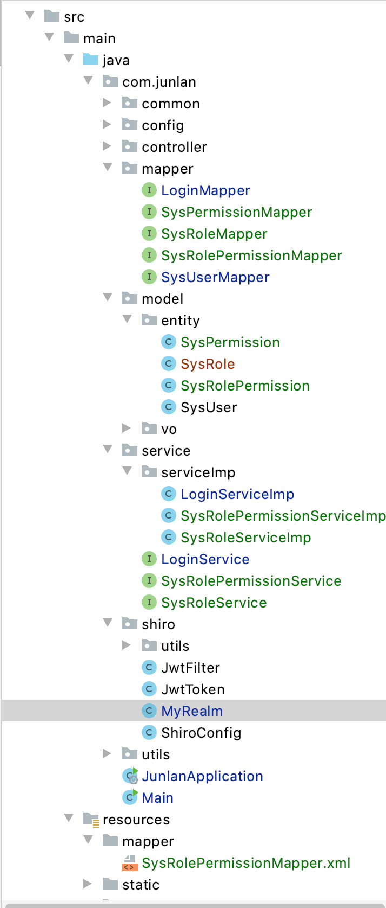

# 小俊兰博客

# 开始步骤

## 1. Swagger


## 2. JWT

## 3. Shiro

## 4. yaml配置

## 5. ApiResult

### 5.1 APICode

- 枚举类

  ```java
  package com.junlan.common.result;
  
  /**
   *
   * REST API 响应码
   *
   */
  public enum ApiCode {
  
      /**
       * 操作成功
       **/
      SUCCESS(200, "操作成功"),
      /**
       * 非法访问
       **/
      UNAUTHORIZED(401, "非法访问"),
      /**
       * 没有权限
       **/
      NOT_PERMISSION(403, "没有权限"),
      /**
       * 你请求的资源不存在
       **/
      NOT_FOUND(404, "你请求的资源不存在"),
      /**
       * 操作失败
       **/
      FAIL(500, "操作失败"),
      /**
       * 登录失败
       **/
      LOGIN_EXCEPTION(4000, "登录失败"),
  
      ;
  
      // 枚举实例具有属性，所以必须提供构造器与域
      private final int code;
      private final String message;
  
      ApiCode(final int code, final String message) {
          this.code = code;
          this.message = message;
      }
  
      // 通过code获取message
      public static ApiCode getApiCode(int code) {
          // 获取所有实例
          ApiCode[] ecase = ApiCode.values();
          for (ApiCode ec : ecase) {
              if (ec.getCode() == code) {
                  return ec;
              }
          }
          return SUCCESS;
      }
  
      public int getCode() {
          return code;
      }
  
      public String getMessage() {
          return message;
      }
  
  }
  ```

### 5.2. ApiResult

- 封装类

  ```java
  package com.junlan.common.result;
  
  import com.fasterxml.jackson.annotation.JsonFormat;
  import lombok.AllArgsConstructor;
  import lombok.Builder;
  import lombok.Data;
  import lombok.experimental.Accessors;
  import org.apache.commons.lang3.StringUtils;
  import org.slf4j.Logger;
  import org.slf4j.LoggerFactory;
  
  import java.io.Serializable;
  import java.util.Date;
  import java.util.HashMap;
  import java.util.Map;
  
  /**
   *
   * REST API 返回结果
   * REST --> Spring Jackson 自动将结果转换为 json
   */
  @Data
  @Accessors(chain = true)        // lombok支持链式构造
  @Builder                        // builder().xxx.xxx.build()
  @AllArgsConstructor
  public class ApiResult<T> implements Serializable {
  	private static final long serialVersionUID = 8004487252556526569L;
  
  	private static final Logger logger = LoggerFactory.getLogger(ApiResult.class);
  
  	/**
       * 响应码
       */
      private int code;
  
      /**
       * 是否成功
       */
      private boolean success;
  
      /**
       * 响应消息
       */
      private String message;
  
      /**
       * 响应数据
       */
      private T data;
  
      /**
       * 响应时间, 时间格式化器
       */
      @JsonFormat(pattern = "yyyy-MM-dd HH:mm:ss", timezone = "GMT+8")
      private Date time;
  
      public ApiResult() {
          time  = new Date();
      }
  
  
      // ================= 返回结果 ==============================
      public static ApiResult<Boolean> result(boolean flag){
          if (flag){
              return ok();
          }
          return fail();
      }
  
      public static ApiResult<Boolean> result(ApiCode apiCode){
          return result(apiCode,null);
      }
  
      public static <T> ApiResult<T> result(ApiCode apiCode, T data){
          return result(apiCode,null, data);
      }
  
      // =============== 总返回器 =====================
      @SuppressWarnings("unchecked")
      public static <T> ApiResult<T> result(ApiCode apiCode, String message, T data){
          boolean success = false;
          if (apiCode.getCode() == ApiCode.SUCCESS.getCode()){
              success = true;
          }
          String apiMessage = apiCode.getMessage();
          if (StringUtils.isNotBlank(apiMessage)){
              message = apiMessage;
          }
  
          // lombok, 时间初始化, builder().xxx.xxx.build()
          return (ApiResult<T>) ApiResult.builder()
                  .code(apiCode.getCode())
                  .message(message)
                  .data(data)
                  .success(success)
                  .time(new Date())
                  .build();
      }
  
  
      // ================ 成功，调用result返回结果 =================
      public static ApiResult<Boolean> ok(){
          return ok(null);
      }
  
      public static <T> ApiResult<T> ok(T data){
          return result(ApiCode.SUCCESS, data);
      }
  
      public static <T> ApiResult<T> ok(T data,String message){
          return result(ApiCode.SUCCESS, message, data);
      }
  
      public static ApiResult<Map<String,Object>> okMap(String key, Object value){
          Map<String, Object> map = new HashMap<>(1);
          map.put(key, value);
          return ok(map);
      }
  
  
      // =============== 失败，返回结果 =========================
      public static ApiResult<Boolean> fail(ApiCode apiCode){
          return result(apiCode,null);
      }
  
      public static ApiResult<String> fail(String message){
          return result(ApiCode.FAIL, message,null);
  
      }
  
      public static <T> ApiResult<T> fail(ApiCode apiCode, T data){
          if (ApiCode.SUCCESS == apiCode){
              throw new RuntimeException("失败结果状态码不能为" + ApiCode.SUCCESS.getCode());
          }
          return result(apiCode, data);
      }
  
      public static  ApiResult<String> fail(Integer errorCode, String message){
          // lombok 支持链式构造-build
          return new ApiResult<String>()
                  .setSuccess(false)
                  .setCode(errorCode)
                  .setMessage(message);
      }
  
      public static ApiResult<Map<String, Object>> fail(String key, Object value){
          Map<String,Object> map = new HashMap<>(1);
          map.put(key, value);
          return result(ApiCode.FAIL, map);
      }
  
      public static ApiResult<Boolean> fail() {
          return fail(ApiCode.FAIL);
      }
  }
  ```
  
  


## 6. 登录完善


### 6.1 概念

#### entity

- entity 里的每一个字段，与数据库相对应

#### VO

- value object 值对象 / view object 表现层对象
- 主要对应页面显示【HTML】的数据对象。
- 可以和表对应，也可以不，这根据业务的需要。

### 6.2 角色权限处理

- 实体类POJO

  ```java
  /**
   * @Author LJ
   * @Date 2020/12/3
   * msg 系统角色
   */
  
  @Data   // lombok
  @Accessors(chain = true)
  @ApiModel(value = "系统sys_role对象", description = "系统角色")
  public class SysRole {
  
      @ApiModelProperty("主键")
      @NotNull(message = "不能为空")
      private Long id;
  
      @ApiModelProperty(value = "角色唯一编码")
      private String roleCode;
  
      @ApiModelProperty(value = "角色对应名称")
      private String roleName;
  }
  
  @Data
  @Accessors(chain = true)
  @ApiModel(value = "Sys_Permission对象")
  public class SysPermission {
  
      @ApiModelProperty("主键")
      @NotNull(message = "不能为空")
      private Long id;
  
      @ApiModelProperty(value = "归属类型编码")
      private String typeCode;
  
      @ApiModelProperty(value = "归属类型名称")
      private String typeName;
  
      @ApiModelProperty(value = "权限对应编码")
      private String permissionCode;
  
      @ApiModelProperty(value = "权限对应名称")
      private String permissionName;
  }
  
  @Data
  @Accessors(chain = true)
  @ApiModel(value = "Sys_Role_Permission对象", description = "一个角色对应多个权限")
  public class SysRolePermission {
  
      @ApiModelProperty("主键")
      @NotNull(message = "不能为空")
      private Long id;
  
      @ApiModelProperty("角色ID")
      @NotNull(message = "不能为空")
      private Long RoleId;
  
      @ApiModelProperty("权限ID")
      @NotNull(message = "不能为空")
      private Long PermissionId;
  }
  ```

- 在写Mapper接口 

  ```java
  /**
   * msg Base-->mybatis-plus
   */
  
  @Repository // DAO层
  public interface SysRoleMapper extends BaseMapper<SysRole> {
  
  }
  ```

  - Mapper 对多多多 **xml**编写

    ```xml
    <?xml version="1.0" encoding="UTF-8"?>
    <!DOCTYPE mapper PUBLIC "-//mybatis.org//DTD Mapper 3.0//EN" "http://mybatis.org/dtd/mybatis-3-mapper.dtd">
    <mapper namespace="com.junlan.mapper.SysPermissionMapper">
    
        <select id="getPermissionCodesByRoleId" resultType="java.lang.String">
            select p.permission_code
            from sys_role r
                     inner join sys_role_permission rp
                                on r.id = rp.role_id
                     inner join sys_permission p
                                on rp.permission_id = p.id
            where r.id = #{roleId};
        </select>
    </mapper>
    ```

    

- 写Service接口及其实现

  ```java
  /**
   * msg   IService --> mybatis-plus:
   */
  public interface SysRoleService extends IService<SysRole> {
  }
  
  /**
   * msg   mybatis-plus -- > ServiceImpl
   */
  @Service	
  public class SysRoleServiceImp extends ServiceImpl<SysRoleMapper, SysRole>
          implements SysRoleService {
  }
  
  /**
   * msg 角色权限实现类
   */
  @Service
  public class SysRolePermissionServiceImp extends ServiceImpl<SysRolePermissionMapper, SysRolePermission>
          implements SysRolePermissionService {
  
      @Autowired
      private SysPermissionMapper sysPermissionMapper;
  
      @Autowired
      private SysRolePermissionMapper sysRolePermissionMapper;
  
      @Override
      public List<Long> getPermissionIdsByRoleId(Long roleId) {
           Wrapper wrapper = lambdaQuery()
                  .select(SysRolePermission::getId)
                  .eq(SysRolePermission::getRoleId, roleId)
                  .getWrapper();
           return sysRolePermissionMapper.selectObjs(wrapper);
      }
  
      @Override
      public Set<String> getPermissionCodesByRoleId(Long roleId) {
          return sysPermissionMapper.getPermissionCodesByRoleId(roleId);
      }
  }
  ```

- `LoginServiceImp`完善

  ```java
  @Slf4j
  @Service
  public class LoginServiceImp implements LoginService {
  
      @Autowired
      private SysUserMapper sysUserMapper;
  
      @Autowired
      private SysRoleService sysRoleService;
  
      @Autowired
      private SysRolePermissionService sysRolePermissionService;
  
      @Override
      public LoginSysUserTokenVO login(String username, String password) throws Exception{
          SysUser sysUser = getUserByName(username);
          if (sysUser == null) {
              log.error("无该用户：{}", username);
              throw new AuthenticationException("用户名错误");
          }
          String encrypt = UserUtil.encrypt(password, sysUser.getSalt());
          if (!sysUser.getPassword().equals(encrypt)) {
              throw new AuthenticationException("用户名或密码错误");
          }
  
          // 系统对象 转 登录对象VO
          LoginSysUserVO loginSysUserVO = new LoginSysUserVO()
                  .setId(sysUser.getId()).setUsername(sysUser.getUsername())
                  .setUsernick(sysUser.getUsernick()).setRoleId(sysUser.getRoleId());
  
          // 获取登录对象角色并设置
          SysRole sysRole = sysRoleService.getById(sysUser.getRoleId());
          loginSysUserVO.setRoleId(sysRole.getId())
                  .setRoleCode(sysRole.getRoleCode())
                  .setRoleName(sysRole.getRoleName());
  
          // 获取登录对象权限编码并设置
          Set<String> sysCodes = sysRolePermissionService.getPermissionCodesByRoleId(sysUser.getRoleId());
          loginSysUserVO.setPermissionCodes(sysCodes);
  
  
          // 生成token
          String token = JwtUtil.createToken(username);
          // 返回token和登录用户信息对象
          LoginSysUserTokenVO loginSysUserTokenVo = new LoginSysUserTokenVO()
                  .setToken(token)
                  .setLoginSysUserVO(loginSysUserVO);
          return loginSysUserTokenVo;
      }
  
      @Override
      public void logout(HttpServletRequest request) {
          Subject subject = SecurityUtils.getSubject();
          subject.logout();
  
          String token = JwtUtil.getToken(request);
          final String username = JwtUtil.getUsername(token);
          log.info("登出成功，username: {}", username);
      }
  
      /**
       * 根据用户名获取用户
       * @param username
       * @return
       */
      @Override
      public SysUser getUserByName(String username) {
          return sysUserMapper.selectOne(new QueryWrapper<SysUser>()
                  .lambda().eq(SysUser::getUsername, username));
      }
  
      @Override
      public String getRodeCode(Long roleId) {
          return sysRoleService.getById(roleId).getRoleCode();
      }
  
      @Override
      public Set<String> getPermissionByRodeId(Long roleId) {
          return sysRolePermissionService.getPermissionCodesByRoleId(roleId);
      }
  }
  ```

- Shiro-->MyRealm完善

  ```java
  /**
   *
   * @Author LJ
   * @Date 2020/11/28
   * 3. Shiro 登录权限配置
   */
  
  @Component
  public class MyRealm extends AuthorizingRealm {
      private static final Logger log = LoggerFactory.getLogger(MyRealm.class);
  
      private LoginService loginService;
  
      public MyRealm(LoginService loginService) {
          this.loginService = loginService;
      }
  
      /**
       * 仅支持JwtToken类型的Token，即需实现AuthenticationToken
       *
       * @param token
       * @return
       */
      @Override
      public boolean supports(AuthenticationToken token) {
          return token != null && token instanceof JwtToken;
      }
  
      /**
       * 授权认证,设置角色/权限信息，只有当需要检测用户权限的时候才会调用此方法
       *
       * @param principals
       * @return
       */
      @Override
      protected AuthorizationInfo doGetAuthorizationInfo(PrincipalCollection principals) {
          String username = JwtUtil.getUsername(principals.toString());
          log.info("验证权限：{}", username);
          Long roleId = loginService.getUserByName(username).getRoleId();
          // 获得该用户角色编码
          String rCode = loginService.getRodeCode(roleId);
          // 获取用户权限编码
          Set<String> pCodes = loginService.getPermissionByRodeId(roleId);
  
          SimpleAuthorizationInfo info = new SimpleAuthorizationInfo();
          info.setRoles(SetUtils.hashSet(rCode));
          info.setStringPermissions(pCodes);
          return info;
      }
  
      /**
       * token验证，在进行登录
       *
       * @param aToken
       * @return
       * @throws AuthenticationException
       */
      @Override
      protected AuthenticationInfo doGetAuthenticationInfo(AuthenticationToken aToken) throws AuthenticationException {
          log.info("验证token：{}", aToken);
          String token = (String) aToken.getCredentials();
          if (StringUtils.isBlank(token)) {
              throw new AuthenticationException("token不能为空");
          }
          return new SimpleAuthenticationInfo(token, token, getName());
      }
  }
  ```

  

  


## 7. 异常处理

```java
/**
 * @Author LJ
 * @Date 2020/12/2
 * msg
 */

@RestControllerAdvice       // 异常处理类
public class MyExceptionHandler {
    /**
     * 登录授权异常处理
     * @param exception
     * @return
     */
    @ExceptionHandler(value = AuthenticationException.class)	// 捕捉异常
    @ResponseStatus(HttpStatus.OK)      //  标记方法或异常类，用应返回的状态
    public ApiResult<String> authenticationExceptionHandler(AuthenticationException exception) {

        return ApiResult.fail(ApiCode.AUTHENTICATION_EXCEPTION, exception.getMessage());
    }
}
```

